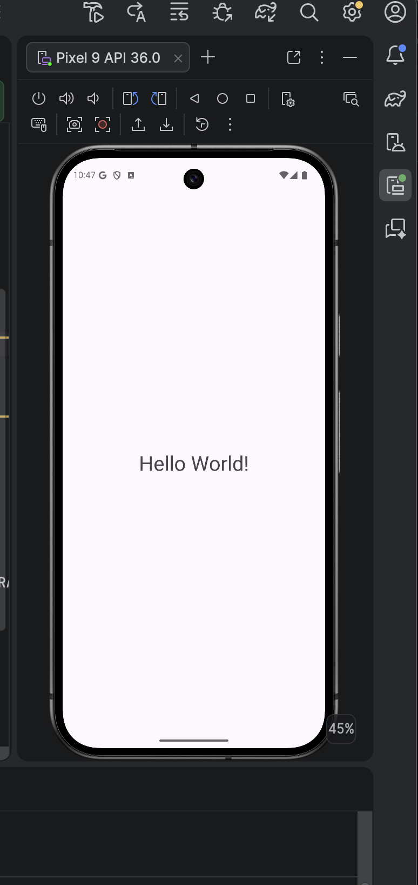
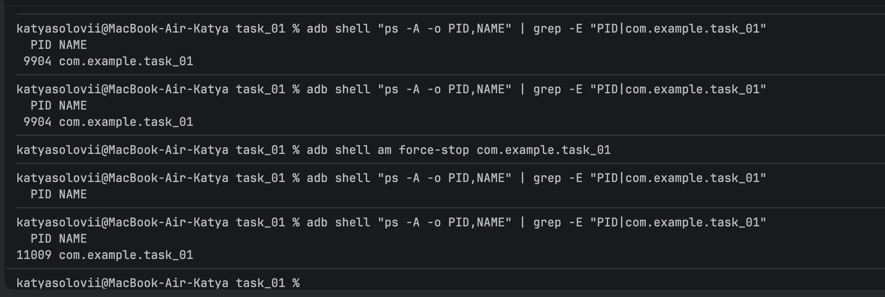

# 2.4. Application. Process. Lifecycle.

## Опис виконаної роботи
1. Підключено бібліотеку для логування **Timber** (`5.0.1`) у `build.gradle.kts` та увімкнено генерацію `BuildConfig`.
2. Створено клас `MyApp`, унаслідуваний від `android.app.Application`, де в методі `onCreate()` реалізовано ініціалізацію `Timber.DebugTree()`.
3. Зареєстровано клас `MyApp` у `AndroidManifest.xml` через атрибут `android:name=".MyApp"`.
4. У `MainActivity` додано вивід повідомлення через `Timber.d()`.
5. Досліджено життєвий цикл процесу через інструмент **ADB** у терміналі.

---

## Інтерфейс застосунку
Базовий екран застосунку з відображенням "Hello World!":

---

## Дослідження процесу через ADB

### Результати:
1. **Запуск застосунку:**
    * Команда: `adb shell "ps -A -o PID,NAME" | grep -E "PID|com.example.task_01"`
    * Початковий PID процесу: **`9904`**.

2. **Згортання застосунку:**
    * Після натискання кнопки "Home" PID залишився **`9904`**.
    * **Чому так:** При згортанні застосунку Android не знищує процес одразу, а утримує його в оперативній пам'яті, щоб за потреби миттєво відновити роботу.

3. **Примусове завершення (Kill):**
    * Команда: `adb shell am force-stop com.example.task_01`.
    * Застосунок повністю зник зі списку процесів, оскільки операційна система видалила його з пам'яті.

4. **Повторний запуск (Відновлення):**
    * Новий PID процесу: **`11009`**.
    * **Чому PID змінився:** Система створила для застосунку абсолютно новий процес з новим числовим ідентифікатором.
    * **Чи зберігся об'єкт `MyApp`:** **Ні, не зберігся.** Життєвий цикл екземпляра `Application` триває стільки ж, скільки живе сам процес. Старий об'єкт було знищено разом із завершенням процесу, а при повторному старті система створила новий екземпляр класу `MyApp` та заново викликала його метод `onCreate()`.