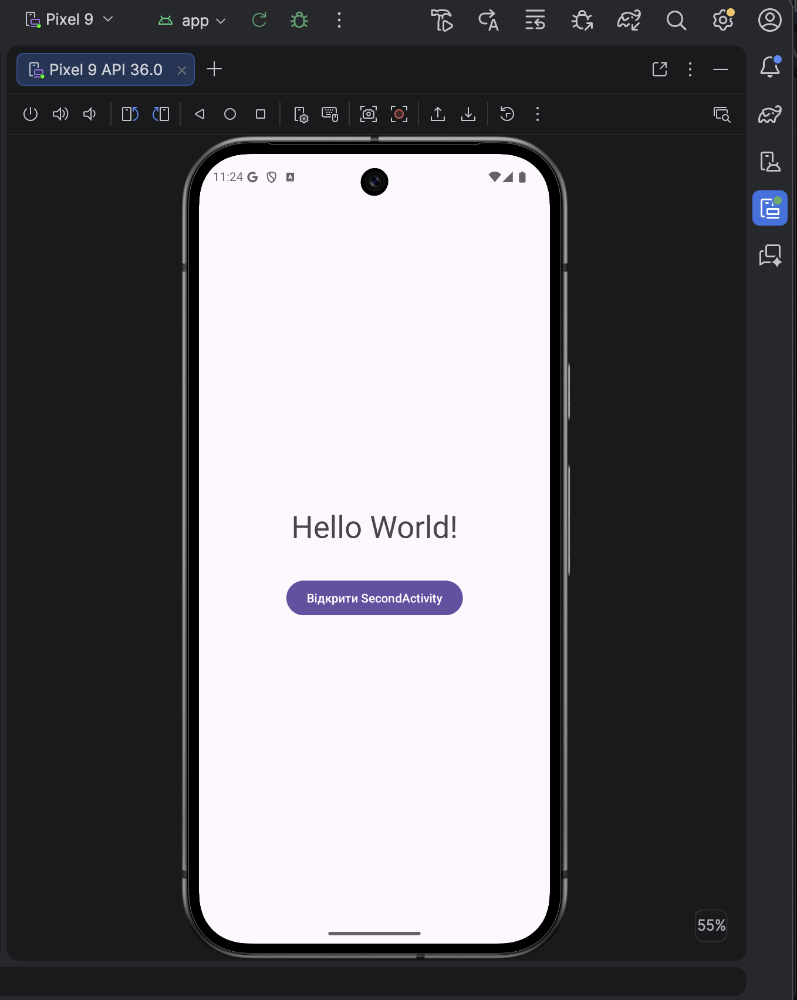
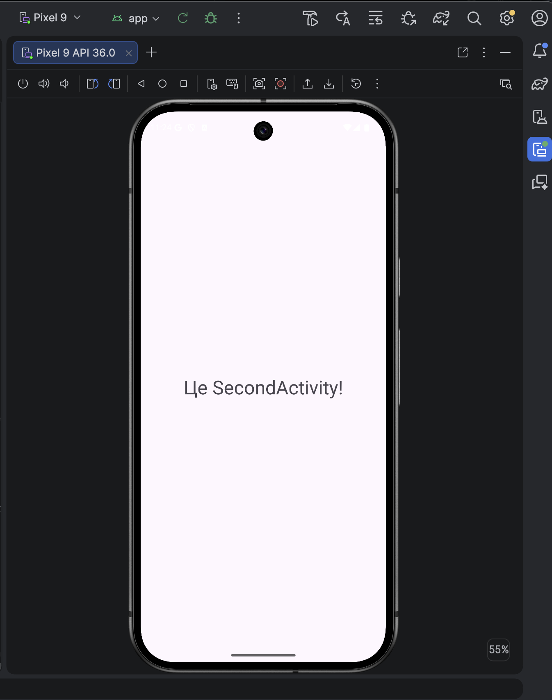

# 2.4. Application. Process. Lifecycle.

## Частина 2: Експерименти з пристроєм

### Сценарій А: Холодний старт
* **Дія:** Запуск застосунку з робочого столу.
* **Методи, викликані один за одним:**
    1) `MainActivity: onCreate()` - виділення пам'яті та створення UI.
    2) `MainActivity: onStart()` - екран стає видимим для користувача.
    3) `MainActivity: onResume()` - екран готовий до взаємодії.

---

### Сценарій Б: Згортання та розгортання
* **Дія 1:** Натискання кнопки "Home" (згортання програми).
    * **Викликані методи:**
        1) `MainActivity: onPause()` - екран став неактивним для дотиків.
        2) `MainActivity: onStop()` - застосунок зник з екрану, але програма не закрилася і продовжує бути в пам'яті телефону.
* **Дія 2:** Повернення до програми через меню недавніх програм (Recent Apps).
    * **Викликані методи:**
        1) `MainActivity: onStart()` - екран знову видимий.
        2) `MainActivity: onResume()` - екран знову активний для натискань.
    * **Чи викликався onCreate():** Ні, метод `onCreate()` не викликався, бо екран не створювався заново з нуля, тому що він нікуди не зникав і весь цей час уже чекав готовим у пам'яті телефону.

---

### Сценарій В: Знищення (Закриття)
* **Дія:** Змахування (свайп) застосунку з меню недавніх програм.
* **Результат:**
    * Викликано метод `MainActivity: onDestroy()`.
    * Об'єкт Activity повністю завершив свій життєвий цикл і був видалений з пам'яті.

---

### Сценарій Г: Поворот екрану (Configuration Change)
* **Дія:** Зміна орієнтації пристрою (на горизонтальну).
* **Повний ланцюжок методів (знищення старого екрана та створення нового):**
    1) `MainActivity: onPause()`
    2) `MainActivity: onStop()`
    3) `MainActivity: onDestroy()`
    4) `MainActivity: onCreate()`
    5) `MainActivity: onStart()`
    6) `MainActivity: onResume()`
* **Пояснення:** Коли користувач повертає телефон набік, Android видаляє старий екран і збирає його з нуля вже в горизонтальному вигляді.

---

## Частина 3: Взаємодія двох Activity

* **Дія:** Натискання кнопки «Відкрити SecondActivity» на екрані.
* **Порядок виклику методів у Logcat:**
    1) `MainActivity: onPause()`
    2) `SecondActivity: onCreate()`
    3) `SecondActivity: onStart()`
    4) `SecondActivity: onResume()`
    5) `MainActivity: onStop()`

### Висновок:
* **Хто кого чекає:** `MainActivity` лише тимчасово призупиняється (`onPause()`), після чого `SecondActivity` створюється, стартує і виходить на передній план (`onResume()`). Тільки після того, як новий екран повністю відобразився й перекрив старий, для `MainActivity` викликається метод `onStop()`.
* **Чому так:** Така архітектура забезпечує плавний візуальний перехід між екранами. Користувач не спостерігає пауз або порожній екран, оскільки попередня активність залишається на екрані, доки наступна повністю не готова до взаємодії.
