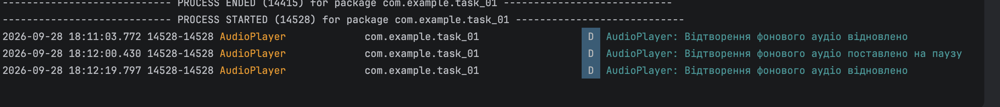
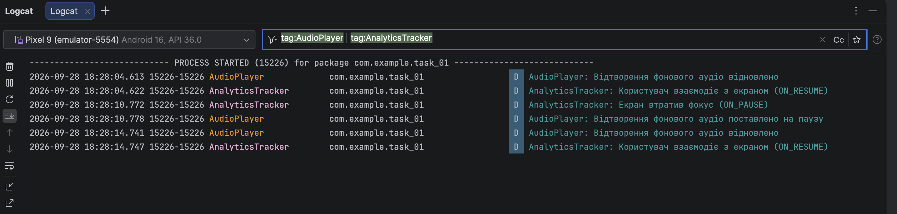
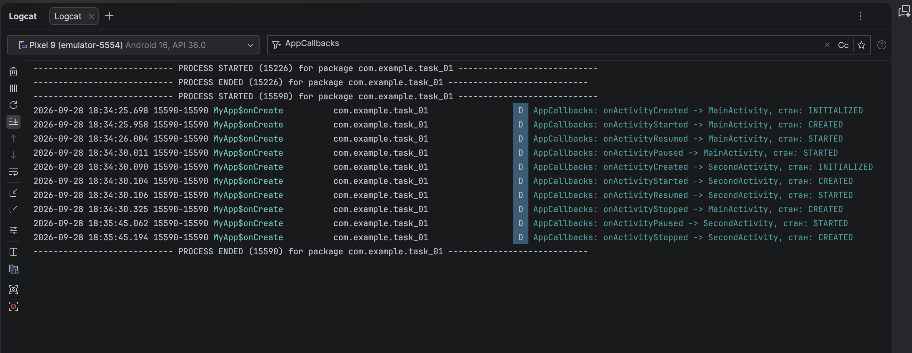

# 2.5. Lifecycle. LifecycleOwner. LifecycleObserver. Context
---

## Частина 1: DefaultLifecycleObserver

* **Результат перевірки в Logcat:**
    * При запуску програми викликається `onStart` плеєра.
    * При згортанні застосунку кнопкою Home плеєр автоматично стає на паузу (`onStop`).
    * При поверненні на екран відтворення відновлюється.

---

## Частина 2: LifecycleEventObserver

* **Результат перевірки в Logcat:**
    * Обидва класи (`AudioPlayer` та `AnalyticsTracker`) працюють паралельно, отримують події незалежно один від одного та не перевантажують код `MainActivity`.

---

## Частина 3: Відстеження Activity та її стану (Lifecycle.State) через Application

* **Результат перевірки в Logcat:**
    * Зафіксовано чітку послідовність зміни станів: при переході спочатку призупиняється `MainActivity` (`onActivityPaused`), після цього створюється та запускається `SecondActivity` (`INITIALIZED` -> `CREATED` -> `STARTED`), і лише коли новий екран з'явився, попередня активність повністю зупиняється (`onActivityStopped`).

