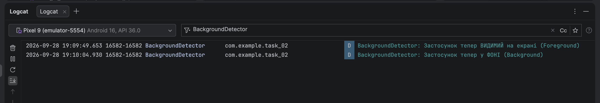
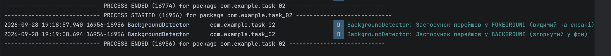

# Звіт до завдання: Створення BackgroundDetector

---

## 1. Детектор із ручним лічильником (Частини 1–4)

* **Результат перевірки в Logcat:**
    * Запуск: `BackgroundDetector: Застосунок тепер ВИДИМИЙ на екрані (Foreground)`.
    * Згортання кнопкою Home: `BackgroundDetector: Застосунок тепер у ФОНІ (Background)`.

---

## 2. Автоматизація та ProcessLifecycleOwner (Частини 5–6)

* **Результат перевірки в Logcat:**
  * При запуску застосунку виведено лог: `BackgroundDetector: Застосунок перейшов у FOREGROUND (видимий на екрані)`
  * При згортанні на головний екран виведено лог: `BackgroundDetector: Застосунок перейшов у BACKGROUND (згорнутий у фон)`

