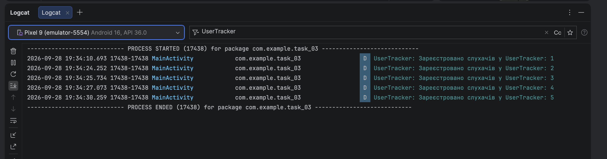
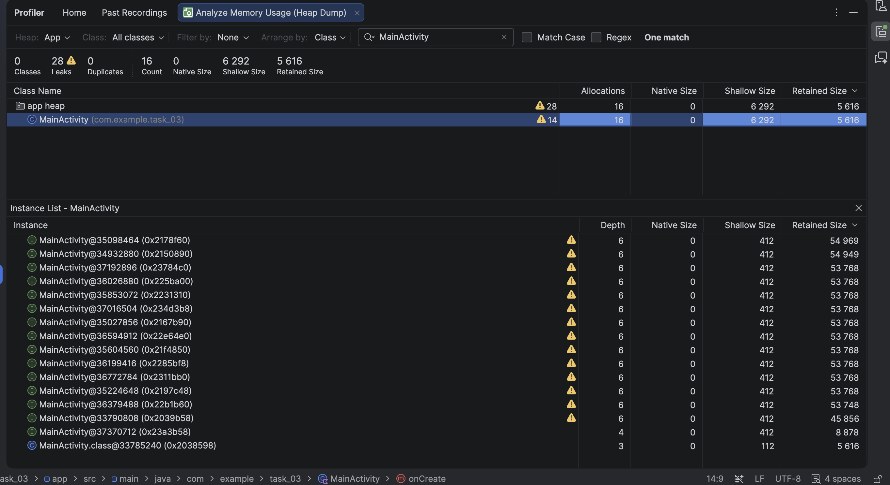
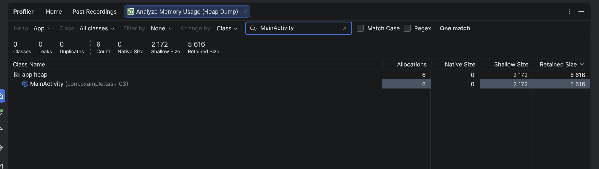

# Звіт до завдання: Виявлення та усунення витоків пам'яті (Memory Leaks)

---

## 1. Створення штучного витоку пам'яті (Частина 1)

* **Результат перевірки в Logcat:**
    * Щоразу під час перевертання телефону лічильник у Logcat збільшувався на одиницю (1, 2, 3, 4, 5...), що вказує на накопичення старих знищених екранів у списку.

---

## 2. Візуалізація витоку через Memory Profiler (Частина 2)

* **Результат:**
    * Інструмент зафіксував наявність критичних витоків (`28 Leaks` у загальній купі пам'яті).
    * У колонці **Allocations** видно, що в пам'яті одночасно зависло 16 копій `MainActivity`замість однієї, і біля них з'явилися значки помилки (витоку).
    * У списку посилань (**References**) чітко видно причину: старі закриті екрани не видаляються, бо за них тримається список `UserTracker.listeners`.

---

## 3. Усунення витоку пам'яті (Частина 3)
* 
* **Результат:**
    * Знято новий **Heap Dump** після серії поворотів екрана.
    * Усі попередження та значки помилок зникли: показник становить **`0 Leaks`**.
    * Знищені екрани `MainActivity` більше не зависають у пам'яті, тому система (Garbage Collector) може вільно їх очистити. 

