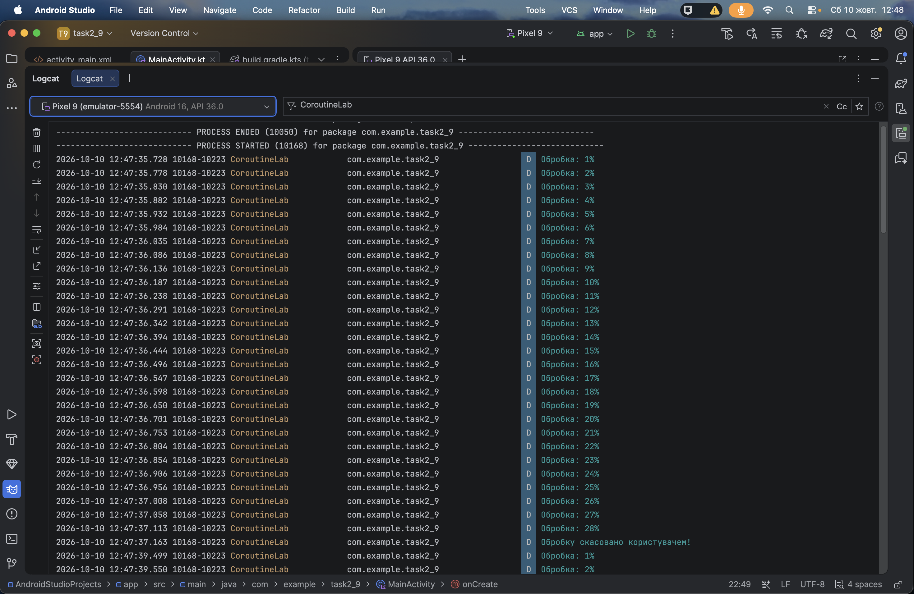
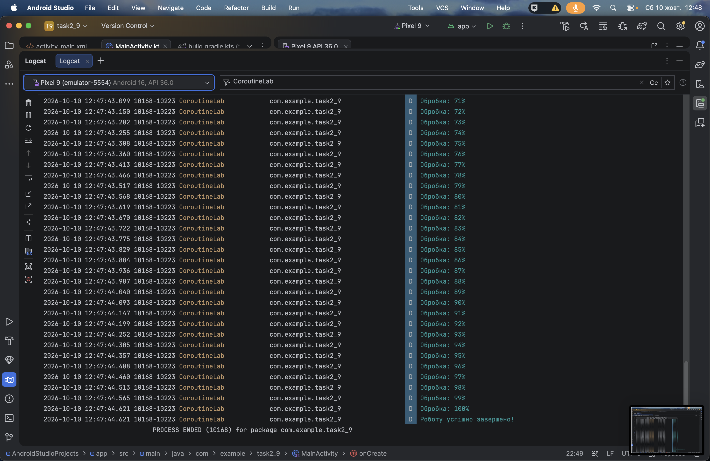
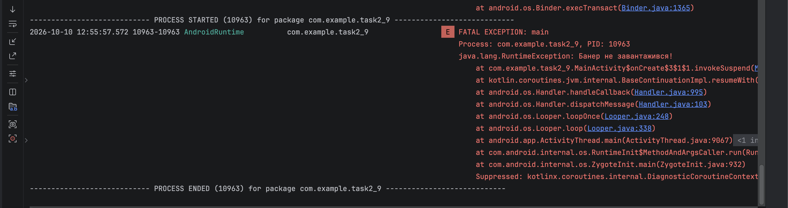
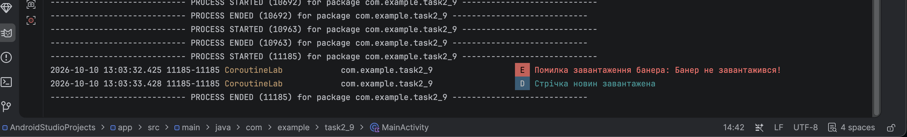
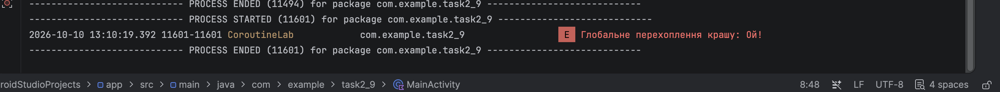

# 2.9. Обробка помилок та Скасування у Корутинах

---

## Блок 1: Кооперативне скасування (Cooperative Cancellation)

- **Результат перевірки в Logcat:**
    * **Скасування процесу:** під час виконання обчислювального циклу `for (1..100)` на `Dispatchers.Default` виклик `calculationJob?.cancel()` через метод `ensureActive()` миттєво перериває обробку та генерує `CancellationException`, виводячи повідомлення про зупинку користувачем.
    * **Повне завершення:** якщо скасування не викликається, цикл безперешкодно доходить до 100% і фіксує успішне завершення задачі.

---

## Блок 2: Ланцюгова реакція при помилках (Двостороннє скасування)

- **Результат перевірки в Logcat:**
    * У рамках стандартного `Job` аварійне завершення першої дочірньої корутини (`RuntimeException: Банер не завантажився!`) по ланцюжку скасовує батьківську корутину та сестринські задачі.
    * Повідомлення `"Стрічка новин завантажена"` не виводиться в консоль, оскільки процес падає до завершення другої задачі.

---

## Блок 3: Ізоляція помилок через SupervisorScope

- **Результат перевірки в Logcat:**
    * Застосування `supervisorScope` ізолює дочірні задачі одна від одної: падіння першої корутини не припиняє виконання інших.
    * У логах фіксується помилка завантаження банера, перехоплена через локальний блок `try-catch`, після чого друга корутина успішно завершується й виводить `"Стрічка новин завантажена"`. Додаток продовжує роботу без крашу.

---

## Блок 4: Глобальний запобіжник (CoroutineExceptionHandler)

- **Результат перевірки в Logcat:**
    * При виникненні необробленого винятку (`IllegalArgumentException("Ой!")`) у межах безпечного контексту `SupervisorJob() + Dispatchers.Main + ceh` спрацьовує `CoroutineExceptionHandler`.
    * Помилка фіксується в логах без закриття застосунку.

